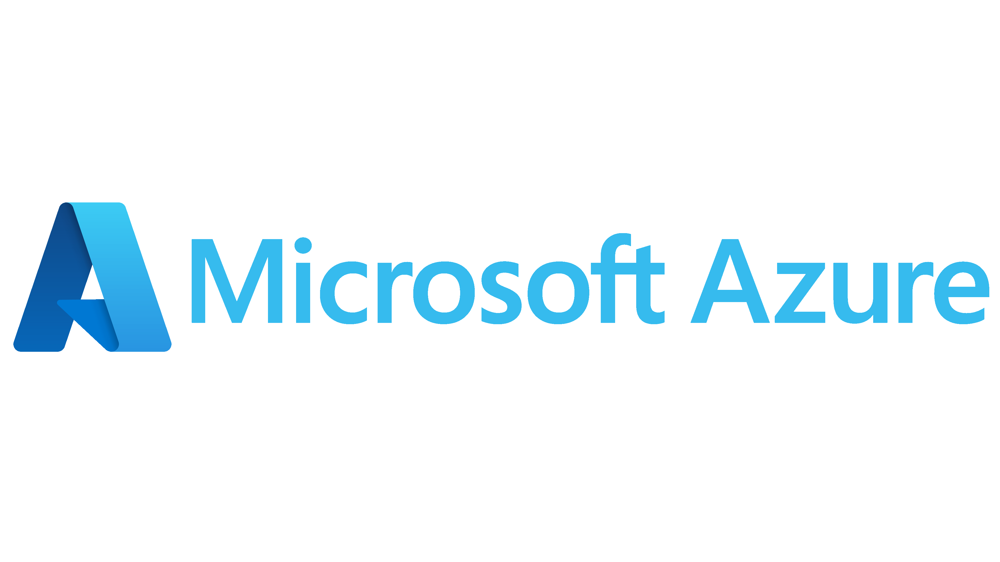

# What is Azure?

<div align="center">



</div>

Microsoft Azure is a comprehensive cloud computing platform provided by Microsoft. It offers a wide range of cloud services from data centers globally, including computing power, storage, databases, networking, analytics, artificial intelligence, machine learning, security, and more.

**Key Benefits:**

- Pay-as-you-go pricing model
- Scalability and flexibility
- Global infrastructure
- High reliability and security
- No upfront infrastructure costs
- Support for cloud, hybrid, and edge environments

---

## Core Azure Services

Azure offers services across multiple categories. Here are the essential ones:

**Compute Services:**

- **Azure Virtual Machines:** Virtual servers in the cloud that you can configure and scale
- **Azure Functions:** Serverless computing that runs code in response to events without managing servers
- **Azure App Service:** Platform for deploying and scaling web applications automatically

**Storage Services:**

- **Azure Blob Storage:** Object storage for any type of data with high durability and scalability
- **Azure Managed Disks:** Persistent block storage for Azure Virtual Machines
- **Azure Archive Storage:** Low-cost storage for data that is rarely accessed
- **Azure Files:** Scalable managed file storage accessible through SMB and NFS

**Database Services:**

- **Azure SQL Database:** Fully managed relational database service supporting SQL Server workloads
- **Azure Cosmos DB:** Fully managed NoSQL database with low latency and global distribution
- **Azure Cache for Redis:** In-memory caching service for improving application performance
- **Azure Synapse Analytics:** Analytics service for data warehousing, big data, and analytics

**Networking Services:**

- **Azure Virtual Network (VNet):** Isolated network environment within Azure
- **Azure DNS:** Scalable DNS hosting service for managing domain name resolution
- **Azure Front Door:** Global application delivery service for fast content distribution
- **Azure ExpressRoute:** Dedicated private network connection from your premises to Azure

**Security and Identity:**

- **Microsoft Entra ID:** Cloud-based identity and access management service for controlling access to Azure resources
- **Azure Key Vault:** Create and manage encryption keys, secrets, and certificates
- **Azure DDoS Protection:** Protection against distributed denial-of-service attacks
- **Azure Web Application Firewall (WAF):** Protect web applications from common web-based attacks

**Management and Monitoring:**

- **Azure Monitor:** Monitoring and observability service for Azure resources and applications
- **Azure Resource Manager (ARM):** Management layer for deploying and managing Azure resources
- **Azure Activity Log:** Log and monitor subscription-level account activity
- **Azure Automation:** Automate repetitive operational tasks and resource management

---

## Azure Cloud Partitions / Cloud Instances

Azure provides separate cloud environments for different geographic, regulatory, and compliance requirements. These environments are isolated from each other and can have different portals, endpoints, services, and compliance requirements.

### 1. **Azure Public Cloud**

The primary Azure cloud environment serving most commercial customers worldwide.

- **Cloud Name:** `AzureCloud`
- **Regions:** Includes standard commercial Azure regions worldwide
- **Examples:** East US, West Europe, Southeast Asia
- **Portal:** `portal.azure.com`
- **Endpoint Format:** Service-specific endpoints using Azure domains
- **Use Case:** General commercial and enterprise workloads globally

### 2. **Azure Government**

A separate Azure cloud environment designed for US government agencies, organizations, and their partners.

- **Cloud Name:** `AzureUSGovernment`
- **Regions:** Government regions such as US Gov Virginia and US Gov Texas
- **Portal:** `portal.azure.us`
- **Use Case:** US government and regulated workloads
- **Key Features:**
  - Designed for US government requirements
  - Supports government-specific compliance requirements
  - Physically isolated from Azure Public Cloud
  - Operated by screened US citizens
  - Separate identity and account environment
  - Service availability can differ from the Public Cloud

### 3. **Microsoft Azure operated by 21Vianet**

A separate Azure cloud environment available in China and operated by 21Vianet.

- **Cloud Name:** `AzureChinaCloud`
- **Regions:** China North, China East, and other China regions
- **Portal:** `portal.azure.cn`
- **Operator:** 21Vianet
- **Use Case:** Azure services for customers operating in China
- **Key Features:**
  - Separate from Azure Public Cloud
  - Operated by 21Vianet
  - Separate account and subscription environment
  - Subject to Chinese regulatory requirements
  - Service availability can differ from the Public Cloud

### 4. **Azure Germany — Historical Cloud**

Azure Germany was a specialized Azure environment designed for German data residency and regulatory requirements.

- **Status:** Historical / Retired
- **Use Case:** Previously used for German regulatory and data residency requirements
- **Important:** Azure Germany was retired and should not be considered a current Azure cloud environment.

**Important Notes About Azure Cloud Environments:**

- Azure Public Cloud, Azure Government, and Azure operated by 21Vianet are separate cloud environments
- Resources and subscriptions are specific to their respective cloud environment
- Identity and account management can differ between environments
- Services and features may vary between cloud environments
- Endpoints and Azure portals can differ between environments
- Compliance and regulatory requirements can differ between environments
- Azure Government and Azure China are isolated from the Azure Public Cloud

### Azure CLI Cloud Environments

Azure CLI supports different cloud environments:

```bash
# List available Azure clouds
az cloud list

# Show the current cloud environment
az cloud show

# Use Azure Public Cloud
az cloud set --name AzureCloud

# Use Azure Government
az cloud set --name AzureUSGovernment

# Use Azure China
az cloud set --name AzureChinaCloud
